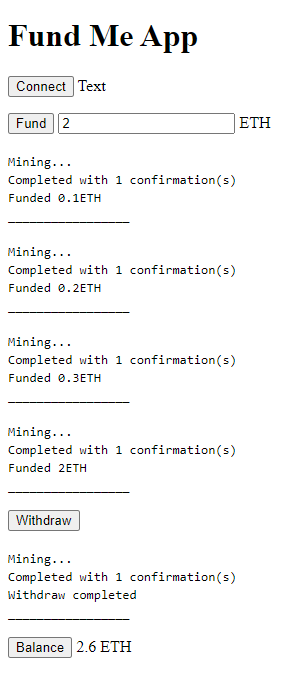
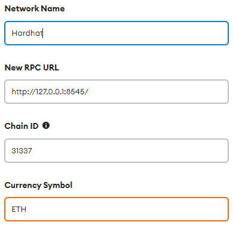
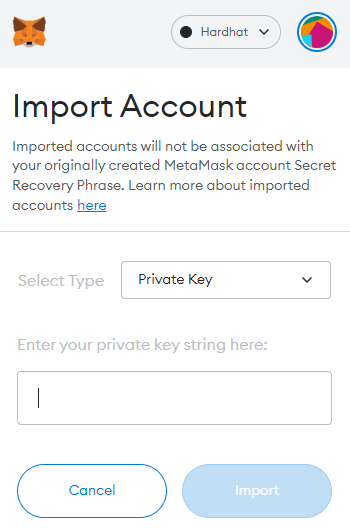

## Getting Started


## Resources
Lesson 8 of the FreeCodeCamp Solidity & Javascript Blockchain Course
* https://github.com/PatrickAlphaC/html-fund-me-fcc

Metamask RPC API
* https://docs.metamask.io/guide/rpc-api.html

🟡 Ethers library (importing)
* https://docs.ethers.io/v5/getting-started/
* https://cdn.ethers.io/lib/ethers-5.6.esm.min.js


# Usage
1. Run the "solidity-patrick-fundme-hardhat" project
```shell
npx hardhat node
```
2. Add new network to metamask


3. Import account to Metamask from running hardhat network

